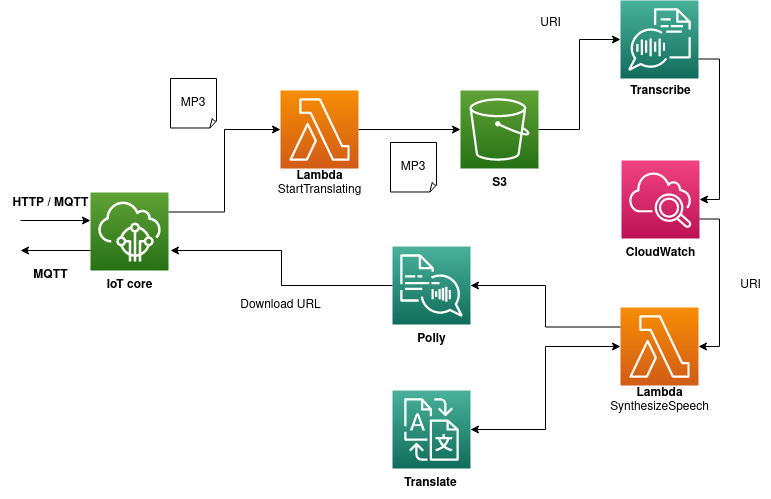

# The project

An iot project made for a course provided by the National University of Taiwan Science and Technology. The project implements a speech translator, iot device which is able to record audio on one language and convert it into a speech on a another language. Speech translation services are provided by AWS.

This repository contains code for lambda functions found under [lambda folder](/lambda) and Web ui found under [speech-translator folder](/speech-translator/). Lambda functions can be deployed straight to AWS and to use the web ui checkout under the [speech-translator readme](/speech-translator/README.md).

# Cloud infrastructure

This is not a detailed view of of how to setup everything in the AWS environment but rather just an overview of how the services interact.

